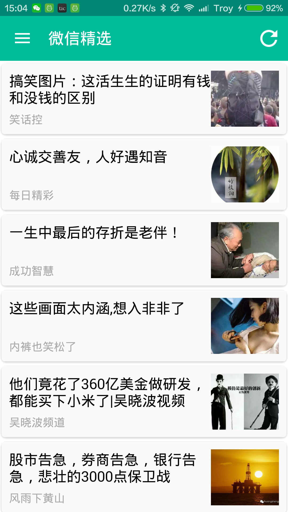
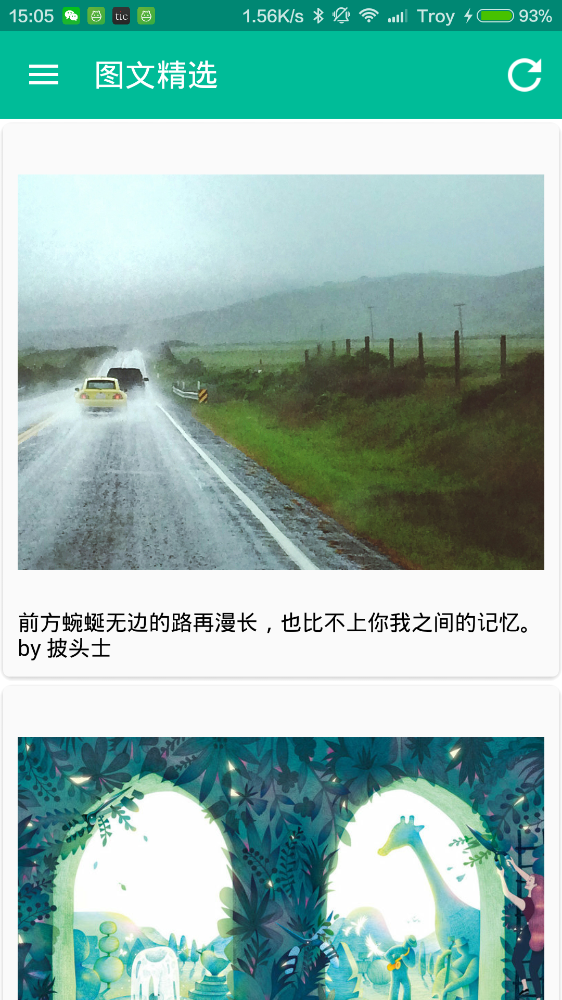
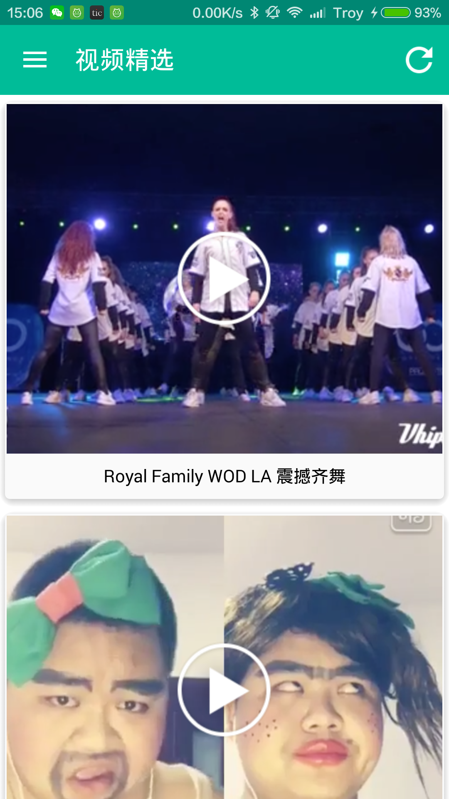
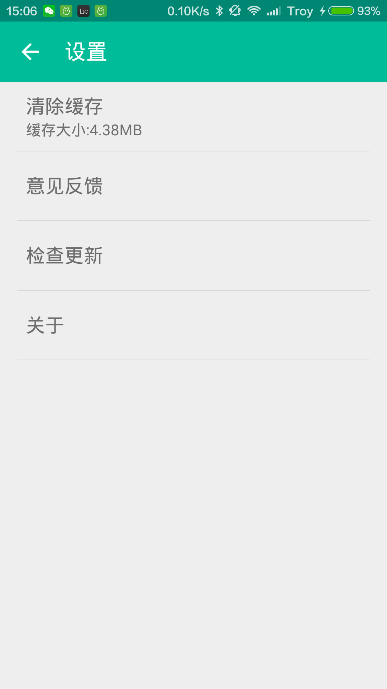

## 简阅
基于Material Design风格的一款应用，包含微信精选，图文浏览，热门视频三个模块。   
此项目纯属练习之作，如有不足，也请多多指教。    
 
 
##功能介绍
###微信精选
*	精选当日热门微信公众号文章，数据来源于[聚合数据](http://www.juhe.cn/)。
*	数据离线缓存。

###图文精选
*	精选图文，数据自来于[一个](http://wufazhuce.com)应用，这里只做测试用，如有侵权请立即告知。
*	使用[leancloud](https://leancloud.cn/)存储数据。
*	数据离线缓存。

###视频精选
*	精选热门视频，数据来源于网络。
*	使用[Baidu-T5Player](http://developer.baidu.com/wiki/index.php?title=docs/cplat/media/video/sdk)播放器
*	数据离线缓存。

##感谢以下开源项目
*	[material-dialogs](https://github.com/afollestad/material-dialogs)
*	[greenDAO](https://github.com/greenrobot/greenDAO)
*	[Android-Universal-Image-Loader](https://github.com/nostra13/Android-Universal-Image-Loader)
*	[Baidu-T5Player](http://developer.baidu.com/wiki/index.php?title=docs/cplat/media/video/sdk)
*	[Gson](https://github.com/google/gson)

##关于我
*	**QQ:**421575839
*	**博客:**[http://www.chenlongfei.cn](http://www.chenlongfei.cn)

